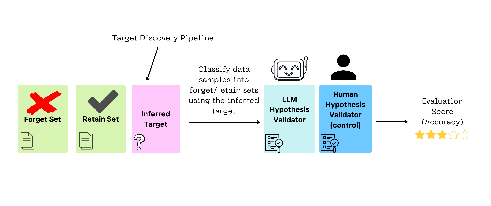

# 🔍 Detecting Unlearning Targets

This repository contains the official implementation for research on **Unlearning Target Detection**. The project aims to identify what specific knowledge has been removed from a Large Language Model (LLM) by analyzing internal activation shifts through Matrix Decomposition.

## 📖 Overview

The core methodology relies on comparing a **Base Model** and its **Unlearned Counterpart**. By decomposing the activation space using Symmetric Non-negative Matrix Factorization (SNMF), we can isolate the features that were altered during the unlearning process and use an LLM-based judge to interpret those changes.


---

## 🛠 Project Structure & Pipeline

The repository is organized according to the research pipeline:

### 1. Dataset Generation

* **Goal:** Create a diverse general dataset to trigger a broad range of model activations.
* **Code:** See `/data_utils/create_general_data.py`

### 2. Activation Collection

* **Goal:** Perform feed-forward passes on both the **Base** and **Unlearned** models.
* **Output:** Layer-wise activation matrices ($A_{\text{base}}$ and $A_{\text{unlearned}}$).

### 3. SNMF Decomposition

* **Goal:** Extract the latent basis of the base model.
* **Formula:** $Z \times Y = A_{\text{base}}$
* $Z$: The basis matrix (dictionary of concepts).
* $Y$: The coefficient matrix (how much each concept is used).

### 4. Audit Process (Target Detection)

* **Projection:** Project $A_{\text{unlearned}}$ onto the fixed basis $Z$ to find the new coefficients $Y^*$:

$$Z \times Y^* = A_{\text{unlearned}}$$

* **Delta Analysis:** Calculate the difference $\Delta Y = Y - Y^*$.
* **LLM Judge:** Feed the most significant deviations to an LLM to determine the unlearning target and provide a confidence score.
* **Output:** `judge_response.json` with `likely_unlearned_concept` and `unlearning_confidence`.

See [`docs/general_unlearning_audit.md`](docs/general_unlearning_audit.md) for the full audit CLI and artifacts.

### 5. Target Evaluation (Hypothesis Validation)

To validate the inferred unlearning target, we evaluate its operational capacity to differentiate between forget-like and retain-like text.

We construct a binary classification task where an evaluator LLM labels individual data samples as forget or retain based solely on the generated hypothesis. To guarantee unbiased evaluation, each sample is processed via a separate API call. The hypothesis quality is then quantified by calculating the Balanced Accuracy and AUC-ROC against the true data partitions.



**Input:** - Forget / Retain corpora — Labeled validation texts (what was unlearned vs. what should remain).
- Inferred target — The `likely_unlearned_concept` generated by the audit judge.

**Example (after an audit run):**

```bash
python3 experiments/evaluation/run_target_evaluation.py \
  --audit-dir outputs/audit/my_run \
  --labeled-data path/to/forget_retain.json \
  --output-dir outputs/audit/my_run/target_evaluation

```

> [!NOTE]
> **Unlearning Metadata & Reproducibility (`unlearning_metadata/`)**
> For detailed documentation on our experimental configurations, refer to the [unlearning_metadata/ README](https://www.google.com/search?q=unlearning_metadata/README.md). This directory contains the grid-search optimization tables and the canonical hyperparameter choices used to generate each paired $(M_{\text{base}}, M_{\text{unlearn}})$ model slice.
> * The `optimal_hyperparams/` subdirectory holds the pre-selected winner CSV matrices grouped by unlearning method and base architecture.
> * Running `extract_optimal_hyperparams.py` dynamically aggregates these source matrices into a structured [`optimal_unlearning_hyperparams.yaml`](https://www.google.com/search?q=unlearning_metadata/optimal_unlearning_hyperparams.yaml) artifact, isolating rerun configurations from downstream baseline evaluation metrics.
> * The core validation pipeline currently tests these layers against our three baseline preliminary evaluation concepts: `Golf`, `Ancient Rome`, and `Uranium`.
> 
> 

---

## 🚀 Getting Started

> [!IMPORTANT]
> This project is currently a **Work in Progress (WIP)**. APIs and script locations are subject to change.

### Installation

```bash
git clone [https://github.com/username/unlearning-detection.git](https://github.com/username/unlearning-detection.git)
cd unlearning-detection
pip install -r requirements.txt

```