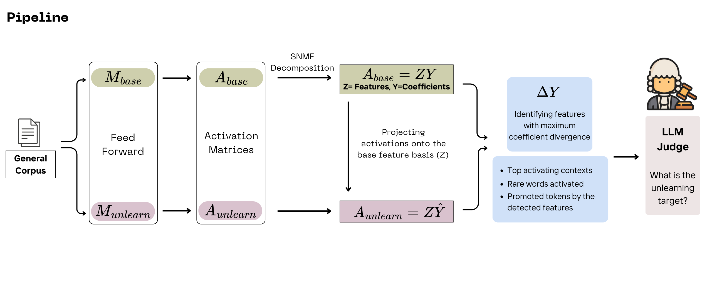

# 🔍 Detecting Unlearning Targets

This repository contains the official implementation for research on **Unlearning Target Detection**. The project aims to identify what specific knowledge has been removed from a Large Language Model (LLM) by analyzing internal activation shifts through Matrix Decomposition.

## 📖 Overview

The core methodology relies on comparing a **Base Model** and its **Unlearned Counterpart**. By decomposing the activation space using Symmetric Non-negative Matrix Factorization (SNMF), we can isolate the features that were altered during the unlearning process and use an LLM-based judge to interpret those changes.




---

## 🛠 Project Structure & Pipeline

The repository is organized according to the research pipeline:

### 1. Dataset Generation

* **Goal:** Create a diverse general dataset to trigger a broad range of model activations.
* **Code:** See `/data_utils/create_general_data.py`

### 2. Activation Collection

* **Goal:** Perform feed-forward passes on both the **Base** and **Unlearned** models.
* **Output:** Layer-wise activation matrices ($A_{base}$ and $A_{unlearned}$).

### 3. SNMF Decomposition

* **Goal:** Extract the latent basis of the base model.
* **Formula:** $Z \times Y = A_{base}$
* $Z$: The basis matrix (dictionary of concepts).
* $Y$: The coefficient matrix (how much each concept is used).


### 4. Audit Process (Target Detection)

* **Projection:** Project $A_{unlearned}$ onto the fixed basis $Z$ to find the new coefficients $Y^*$:

$$Z \times Y^* = A_{unlearned}$$


* **Delta Analysis:** Calculate the difference $\Delta Y = Y - Y^*$.
* **LLM Judge:** Feed the most significant deviations to an LLM to determine the unlearning target and provide a confidence score.

---

## 🚀 Getting Started

> [!IMPORTANT]
> This project is currently a **Work in Progress (WIP)**. APIs and script locations are subject to change.

### Installation

```bash
git clone https://github.com/username/unlearning-detection.git
cd unlearning-detection
pip install -r requirements.txt

```